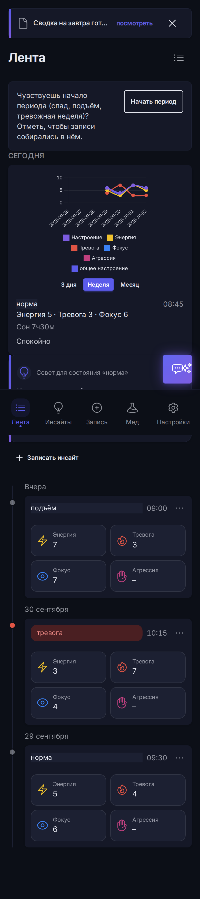
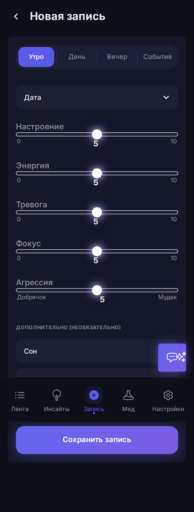
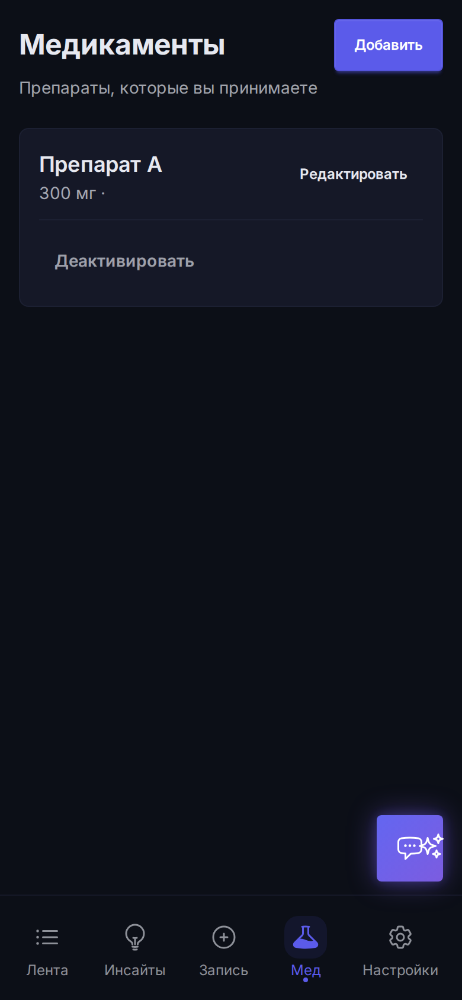
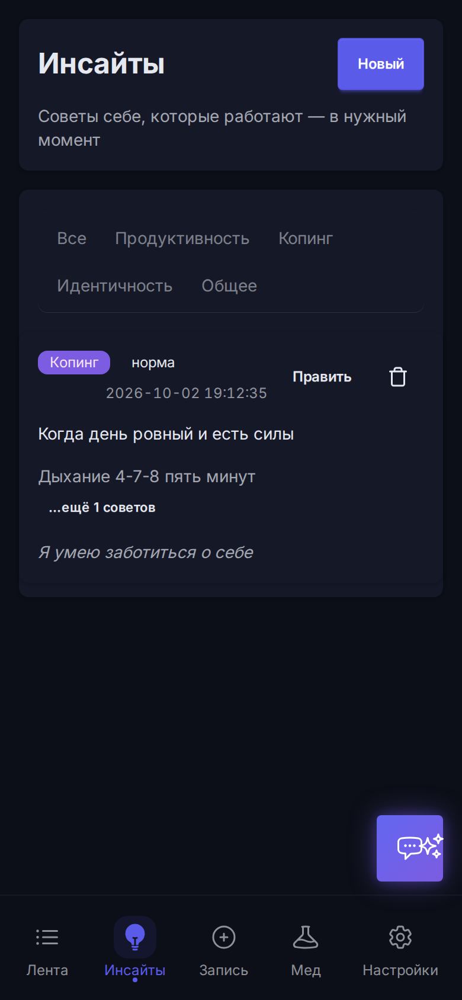
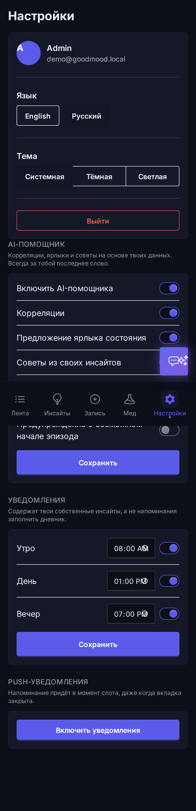

# Good Mood

Трекер настроения при биполярном расстройстве. Помогает отслеживать состояние, находить паттерны и получать персональные инсайты на основе собственных записей.

## Скриншоты

Мобильный интерфейс; данные — демонстрационная «рыба» из seed-а.

<p align="center">
  
  
  
  
  
</p>

## Стек

Clojure, deps.edn, Ring + Jetty, reitit, Integrant, Hiccup2, htmx + hyperscript, Tailwind CSS + DaisyUI, SQLite, next.jdbc, HoneySQL, migratus, Malli. AI через OpenRouter API.

## Запуск

### Env-переменные

| Переменная | Обязательна | Описание |
|---|---|---|
| `GOODMOOD_SESSION_SECRET` | да | Секрет для подписи cookie-сессий (`system.clj`) |
| `OPENROUTER_API_KEY` | нет | Ключ OpenRouter для AI-функций. Без него AI-функции возвращают nil (graceful degradation) |

### Команды

```bash
# Запуск приложения (порт 3000)
GOODMOOD_SESSION_SECRET="your-secret-here" clj -M -m app.core

# Health-check
curl http://localhost:3000/

# Unit-тесты
clj -M:test

# E2E-тесты (Playwright)
cd e2e && npx playwright test
```

## Фичи

- **Entries** — записи состояния: энергия, тревога, фокус, настроение, сон, заметки
- **Feed** — главная: текущее состояние, AI-инсайты, polling-баннеры
- **Check-in** — пошаговый чек-ин для записи состояния
- **Medications** — учёт медикаментов: CRUD, лог приёма, активация/деактивация
- **Insights** — инсайты пользователя: контекст + советы себе, привязка к state-меткам
- **State periods** — marking эпизодов (депрессия/мания/смешанное), группировка записей
- **Notifications** — 3 слота (утро/день/вечер), время и включённость, баннер «пока тебя не было»
- **AI** (opt-in) — корреляции, AI-ярлыки состояния, советы из своих инсайтов, novel-советы, чат с ассистентом, предупреждения об эпизодах
- **Settings** — настройки уведомлений и AI (master-toggle + per-function)
- **i18n** — русская и английская локали

## Документация

- [AGENTS.md](./AGENTS.md) — конвенции, правила, guide для AI-агентов и контрибьюторов
- [openspec/specs/](./openspec/specs/) — спецификации возможностей системы
- [CODESTYLE.md](./CODESTYLE.md) — кодстайл
- [CLOJURE-RULES.md](./CLOJURE-RULES.md) — правила архитектуры
